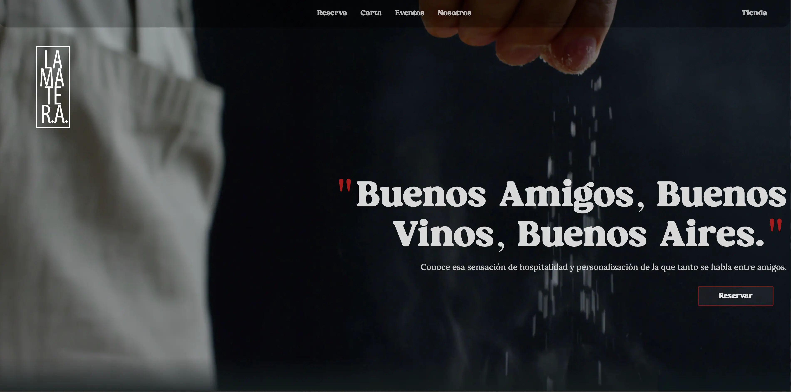

# 🍖 La Matera - Restaurante Argentino

[](https://astro.build/)
[](https://tailwindcss.com/)
[](https://threejs.org/)
[](https://supabase.com/)
[](https://clerk.com/)



## 📋 Descripción del Proyecto

Este fue mi primer proyecto freelance real: un rediseño completo del sitio web para **La Matera**, un restaurante argentino en Guadalajara con gran tradición en la ciudad. El objetivo principal era crear una experiencia web más atractiva y moderna que mejorara la comunicación de los platillos hacia los clientes, alejándose del diseño anterior y generando mayor engagement.

### 🎯 Objetivos del Proyecto
- Rediseñar completamente la presencia web del restaurante
- Crear una experiencia visual atractiva que comunique la calidad de los platillos
- Mejorar la accesibilidad para reservaciones
- Mostrar el menú de forma interactiva y visualmente agradable
- Implementar efectos visuales que transmitan la atmósfera del restaurante

## 🚀 Tecnologías Utilizadas

- **Astro 5.7.11** - Framework principal (SSR mode)
- **Tailwind CSS 3.3.2** - Estilos y diseño responsivo
- **Three.js 0.162.0** - Efectos visuales 3D (partículas de humo)
- **Clerk** - Autenticación y gestión de sesiones de usuario
- **Supabase 2.100.0** - Base de datos PostgreSQL, Storage para imágenes y API
- **Node.js Adapter** - Para renderizado del lado del servidor

## ✨ Características Principales

### 🎨 Efectos Visuales
- **Efecto de humo con Three.js**: Animación de partículas 3D en el fondo que da profundidad y atmósfera
- **Video hero en la portada**: Presentación impactante del restaurante
- **Efectos de luces de fondo**: Ambiente visual mejorado
- **Máscaras degradadas**: Transiciones suaves entre secciones

### 📱 Secciones del Sitio
1. **Home/Reserva**: Landing page con video y CTA para reservar vía WhatsApp
2. **Carta Digital**: Menú completo organizado por categorías:
   - Empanadas
   - Pizzas
   - Entradas
   - Ensaladas
   - Cocina (pastas)
   - Campo (carnes)
   - Mar (mariscos)
   - Granja (pollo)
   - Postres
3. **Eventos**: Carrusel informativo sobre servicios de eventos
4. **Nosotros**: Historia y valores del restaurante

### 📐 Diseño Responsivo
- Mobile-first approach
- Navegación adaptable (menú hamburguesa en móvil)
- Carruseles horizontales optimizados para touch
- Imágenes optimizadas en formato WebP

### 🔐 Panel Interno del Equipo (Dropbox)

Una sección privada del sitio diseñada exclusivamente para el equipo del restaurante, orientada a la **capacitación del menú** y la **gestión interna de platillos y recetas**. Combina Clerk para autenticación y Supabase como base de datos y storage.

#### Autenticación y Roles
- **Clerk** gestiona el login, sesiones y la UI de autenticación (`<SignedIn>`, `<UserButton>`)
- Al iniciar sesión por primera vez, el middleware sincroniza automáticamente el usuario de Clerk con la tabla `usuarios` en Supabase, asignándole el rol `"user"` por defecto
- Los **administradores** (`rol: "admin"`) tienen acceso completo al CRUD de platillos; los usuarios regulares solo pueden consultar el manual y los platillos existentes
- Las rutas `/api/admin/*` están protegidas a nivel de middleware: sin autenticación devuelve `401`, sin rol admin devuelve `403`

#### Tab "Manual" — Capacitación del menú
- Contenido del manual oficial de alimentos del restaurante, organizado por categorías: Empanadas, Entradas, Ensaladas, Pizzas, Cocina, Mar, Campo (Cortes) y Términos de Cocción
- Dentro de cada sección, se inyectan los **platillos agregados desde Supabase** que coinciden por categoría, marcados con la etiqueta "Agregados recientemente" y un borde rojo para diferenciarlos del contenido base

#### Tab "Platillos" — Gestión interna (solo admins)
- Lista de todos los platillos almacenados en Supabase con imagen, título, descripción, gramaje y categoría
- **CRUD completo** disponible para administradores:
  - **Crear**: Formulario modal con campos de título, categoría, descripción, gramaje e imagen (con preview)
  - **Editar**: Modifica cualquier platillo existente reutilizando el mismo modal
  - **Eliminar**: Eliminación con confirmación
- Las imágenes se suben al bucket `imagenes-platillos` de Supabase Storage y se vinculan automáticamente al platillo

#### Arquitectura del backend

```
Usuario → Clerk (login) → middleware.ts → Supabase (consulta por clerk_id)
```

| Recurso | Ruta | Descripción |
|---|---|---|
| Platillos (CRUD) | `GET/POST/PUT/DELETE /api/admin/platillos` | Operaciones sobre la tabla `platillos` |
| Upload de imágenes | `POST /api/admin/upload` | Sube imagen a Supabase Storage |

#### Modelo de datos (Supabase)

```
┌──────────────┐    ┌─────────────────────────┐
│   usuarios   │    │       platillos          │
├──────────────┤    ├─────────────────────────┤
│ id (uuid)    │    │ id (uuid)               │
│ clerk_id     │    │ categoria (text)        │
│ name         │    │ titulo (text)           │
│ email        │    │ descripcion (text)      │
│ rol (enum)   │    │ gramaje (text)          │
└──────────────┘    │ imagen_url (text)       │
                    │ created_at (timestamptz)│
                    │ updated_at (timestamptz)│
                    └─────────────────────────┘

Storage: Bucket "imagenes-platillos"
```

## 🎓 Lo Que Aprendí (Reflexión Honesta)

### ✅ Logros
- **Primera experiencia real con un cliente**: Aprendí a comunicarme, recibir feedback y ajustar según las necesidades reales
- **Implementación de efectos avanzados**: Logré integrar Three.js para crear una experiencia visual única
- **Optimización de imágenes**: Todo el sitio usa WebP para mejor rendimiento
- **SEO básico**: Implementé meta tags, Open Graph y Twitter Cards
- **Responsive design**: El sitio funciona bien en diferentes dispositivos

### 🔧 Áreas de Mejora (Lo Que Haría Diferente Hoy)

#### Organización del Código
- **Datos del menú principal aún hardcodeados**: El menú público sigue directamente en el componente, aunque los platillos del panel interno ya se gestionan desde Supabase
- **Componentes grandes**: Algunos componentes como `pruebaCartaContenedor.astro` tienen demasiada responsabilidad
- **Nombres inconsistentes**: Mezcla de español e inglés en nombres de archivos y variables (ej: `Caurosel` en lugar de `Carousel`)
- **Componentes sin usar**: Varios archivos como `AsadosDeTira.astro`, `Filetes.astro` parecen no estar en uso

#### Arquitectura
- **Falta de separación de concerns**: Lógica, datos y presentación mezclados en los mismos archivos
- **No hay gestión de estado**: Para una aplicación más compleja se necesitaría algo como Nanostores

#### Accesibilidad
- **Faltan algunos alt texts**: No todas las imágenes tienen descripciones significativas
- **Navegación por teclado**: Podría mejorarse la navegación sin mouse
- **Contraste de colores**: Algunas áreas con `text-white/65` podrían tener problemas de contraste

#### Performance
- **Video sin optimización**: El video de hero es grande y no tiene fallback
- **Lazy loading limitado**: No se implementó carga diferida en todas las imágenes
- **JavaScript no optimizado**: El efecto de humo se ejecuta constantemente

## 📦 Instalación y Uso

```bash
# Clonar el repositorio
git clone https://github.com/AlanSan1195/matera-landing.git

# Instalar dependencias
pnpm install

# Ejecutar en desarrollo
pnpm dev

# Construir para producción
pnpm build

# Vista previa de la build
pnpm preview
```

### 🔑 Variables de Entorno

Crea un archivo `.env` en la raíz del proyecto con las siguientes variables:

```bash
# Clerk — Autenticación
PUBLIC_CLERK_PUBLISHABLE_KEY=pk_...   # Key pública (client-side)
CLERK_SECRET_KEY=sk_...               # Key secreta (server-side)

# Supabase — Base de datos y Storage
SUPABASE_URL=https://xxxxx.supabase.co
SUPABASE_KEY=eyJhbGci...              # anon key o service role key
```

> Las keys de Clerk se obtienen en [dashboard.clerk.com](https://dashboard.clerk.com) y las de Supabase en [supabase.com/dashboard](https://supabase.com/dashboard) > Settings > API.

## 🌐 Despliegue

El sitio está configurado para SSR (Server-Side Rendering) con el adaptador de Node.js en modo standalone.

```bash
# Después de hacer build
node dist/server/entry.mjs
```

## 📁 Estructura del Proyecto

```
├── public/                    # Archivos estáticos
│   ├── imagenes/             # Imágenes del sitio (WebP)
│   ├── fuentes/              # Tipografías personalizadas
│   └── video.mp4             # Video hero
├── src/
│   ├── components/           # Componentes Astro reutilizables
│   │   └── icons/            # Componentes SVG de iconos
│   ├── data/
│   │   └── manualData.ts     # Datos del manual de capacitación
│   ├── db/
│   │   └── supabase.ts       # Cliente Supabase, tipos e interfaces, CRUD
│   ├── layouts/              # Layout principal (HTML shell, CSS global)
│   ├── pages/
│   │   ├── api/
│   │   │   └── admin/
│   │   │       ├── platillos.ts  # CRUD de platillos (GET/POST/PUT/DELETE)
│   │   │       └── upload.ts     # Subida de imágenes a Supabase Storage
│   │   ├── Dropbox.astro     # Panel interno del equipo (manual + gestión)
│   │   └── index.astro       # Página principal del restaurante
│   ├── middleware.ts         # Clerk auth + sincronización Supabase + protección de rutas
│   └── env.d.ts              # Tipos de Astro, Clerk y Astro.locals extendidos
├── astro.config.mjs          # Configuración de Astro (SSR + Clerk + Node adapter)
└── tailwind.config.cjs       # Configuración de Tailwind (colores, fuentes)
```

## 🎨 Personalización

### Fuentes
- **Lora Variable**: Fuente principal del sitio
- **Boldes (Magical Night)**: Fuente personalizada para títulos
- **Permanent Marker**: Fuente decorativa

### Colores (Tailwind)
```javascript
{
  primary: "#0C1018",   // Negro principal
  secundary: "#efefef", // Blanco/Gris claro
  tercero: "#ff3b3f",   // Rojo acento
}
```

## 📸 Screenshots


## 🔮 Posibles Mejoras Futuras

### Corto Plazo
- [ ] Migrar datos del menú a archivos JSON
- [x] ~~Implementar un CMS headless~~ — Resuelto con Supabase como backend de datos
- [ ] Mejorar accesibilidad (ARIA labels, navegación por teclado)
- [ ] Optimizar el video hero
- [ ] Implementar lazy loading en todas las imágenes

### Mediano Plazo
- [ ] Sistema de reservas integrado (no solo WhatsApp)
- [x] ~~Página de administración para actualizar menú~~ — Implementado en `/Dropbox` con CRUD de platillos y roles admin
- [ ] Integración con sistema de pedidos en línea
- [x] ~~Blog de recetas o noticias del restaurante~~ — Parcialmente cubierto con el manual interno de capacitación
- [ ] Galería de fotos de clientes

### Largo Plazo
- [ ] Progressive Web App (PWA)
- [ ] Sistema de fidelización de clientes
- [ ] Integración con redes sociales
- [ ] Analytics avanzados

## 🤝 Contribuciones

Este proyecto fue desarrollado como freelance para un cliente real. Si encuentras bugs o tienes sugerencias, siéntete libre de abrir un issue.

## 📝 Licencia

Proyecto privado desarrollado para La Matera Restaurante.

## 🙏 Agradecimientos

- **La Matera**: Por confiar en mí para su primer proyecto web profesional
- **Comunidad de Midudev**: Por el tutorial del efecto de humo con Three.js
- **Fernando Herrera**: Por el slider adaptado en el carrusel

---

### 💭 Nota Personal

Este fue mi primer proyecto real como desarrollador freelance. Mirando atrás, veo muchas cosas que haría diferente hoy, pero también estoy orgulloso de lo que logré con los conocimientos que tenía en ese momento. Cada línea de código, cada error y cada solución fueron parte de mi aprendizaje. Este README refleja no solo el proyecto, sino también mi crecimiento como desarrollador.

**Lo más importante que aprendí**: Un código que funciona y resuelve el problema del cliente tiene valor, incluso si no es perfecto. La perfección viene con la práctica y la experiencia.

---

**Desarrollado con ❤️ por [Alan Sandoval](https://github.com/AlanSan1195)**

🌐 [lamatera.online](https://lamatera.online)
